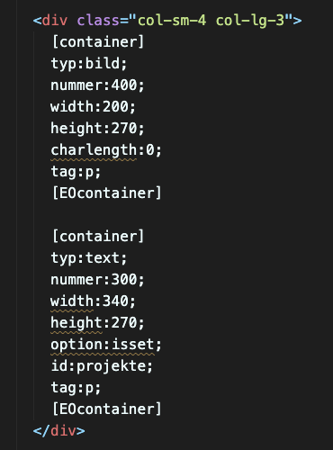
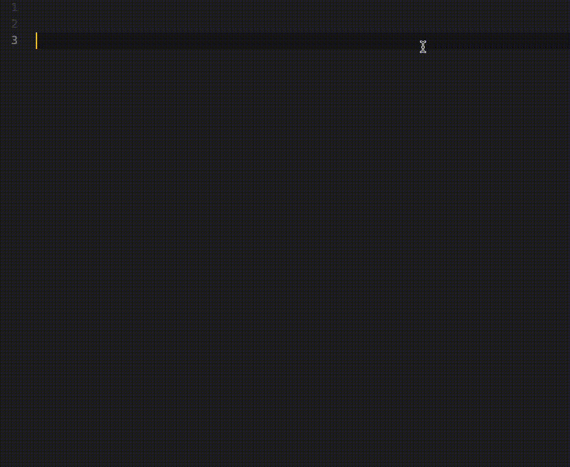

# VS Code CMS-Backend Template Extension

## Description

This extension provides language diagnostics and snippets in Visual Studio Code for CMS-Backend Templates.

## Features

- Deprecation warnings for outdated syntax
- Snippets for common template structures

## Usage

### Deprecation Warnings

This extension provides deprecation warnings for outdated syntax in the Klickmeister CMS-Backend Templates. It helps developers identify and update their code to use the latest syntax.
Diagnostics are available inside of PHP/HMTL files. The diagnostics will provide warnings for outdated syntax in the Klickmeister CMS-Backend Templates.

## Snippets

This extension includes snippets for common template structures in the Klickmeister CMS-Backend Templates.
Snippets are available inside of PHP/HTML files. The snippets can be used to quickly generate code for frequently used patterns in the Klickmeister CMS-Backend Templates.

List of available snippets:

- `cmstemplate`: Generates a basic template structure
- `cmstext`: Generates a text field
- `cmsbild`: Generates an image field
- `cmsenum`: Generates an dropdown field

## License

Klickmeister © 2024. Released under the MIT License.
